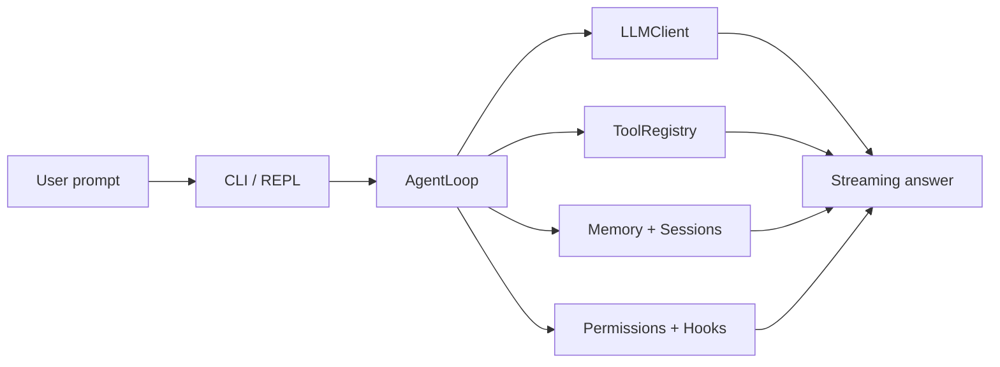

# MiniHarness

MiniHarness is a teaching-first mini coding agent harness. It keeps the core pieces of an agent loop—streaming model calls, tool execution, permissions, memory, session persistence, hooks, and context compaction—while staying compact enough to read end to end.

Chinese: [README.zh-CN.md](./README.zh-CN.md)

## What it does

- Runs a single-agent conversation loop with async streaming output.
- Supports Qwen (DashScope), OpenAI, and OpenAI-compatible chat endpoints.
- Exposes workspace tools through Pydantic-validated schemas.
- Persists sessions to disk so you can resume later.
- Keeps lightweight project memory in local files.
- Applies layered safety checks through permissions and hooks.
- Can run bash commands inside an optional Docker sandbox.

## Architecture at a glance



The main flow is:

`user input → conversation history → streaming LLM call → tool execution → repeat until final answer`

## Real capabilities

### Agent loop

- Async streaming responses with tool-call support.
- Retry handling for transient API errors with exponential backoff and jitter.
- Automatic handling of prompt-too-long errors via context compaction.
- Re-negotiates `max_tokens` when a provider rejects the requested limit.

### Tools

Built-in tools are exposed as OpenAI-style tool schemas:

- `read_file` — read a UTF-8 file in the workspace.
- `ls` — list files and directories.
- `grep` — search literal text under the workspace.
- `write_file` — create or overwrite a file.
- `edit_file` — replace an exact string match in a file.
- `bash` — run shell commands in the workspace or sandbox.
- `web_fetch` — fetch a URL and convert HTML to plain text.
- `task` — maintain a replace-all task list for multi-step work.
- `memory_search` — search semantic and episodic memory.
- `memory_add` — store a semantic fact.
- `memory_log` — record a completed task in episodic memory.

Notes:

- Tool inputs are validated with Pydantic.
- `edit_file` uses exact `old_str` / `new_str` replacement, not unified diffs.
- File operations stay inside the workspace boundary.

### Safety and control

- `read_file`, `ls`, and `grep` are read-only.
- `write_file`, `edit_file`, and `bash` ask for confirmation by default.
- Hooks can block dangerous commands and sensitive file paths.
- Audit logging is enabled by default and writes JSONL entries under `~/.miniharness/audit/`.
- Optional code-security review hooks are available, but disabled by default.
- The sandbox mode runs `bash` inside Docker with `--network none` and the workspace bind-mounted at the same path.

### Memory and sessions

- Core memory lives in `core.md` under the project memory directory and is injected into the system prompt.
- Relevant semantic and episodic memories are retrieved on demand and added to the prompt.
- Session snapshots are stored under `~/.miniharness/sessions/<project-slug>/`.
- You can list sessions, resume by ID or tag, and continue the latest session.

### Context management

- The system prompt includes environment details such as OS, shell, date, and working directory.
- A 4-tier compaction pipeline reduces context when the estimated budget is exceeded:
	1. Microcompact old tool results.
	2. Collapse the middle of oversized text blocks.
	3. Condense earlier turns into session memory.
	4. Fall back to an LLM-generated compact summary with structured attachments.
- The soft budget defaults to 80% of the model context window.

## Quick start

1. Install dependencies

```bash
git clone <repo-url> && cd miniharness
uv sync --extra dev
```

2. Configure credentials

The project loads `.env` automatically. Copy `.env.example` if you want a template:

```bash
cp .env.example .env
```

Set one of the supported provider keys in `.env` or your shell environment:

- `DASHSCOPE_API_KEY` for Qwen / DashScope
- `OPENAI_API_KEY` for OpenAI
- `MINIHARNESS_API_KEY` for an OpenAI-compatible endpoint that uses a single key

3. Run the agent

```bash
uv run mh "explain this project"
uv run mh --dry-run "test"
uv run mh --sandbox "list files"
uv run mh -m gpt-4.1-mini "..."
```

If you run `uv run mh` without a prompt, MiniHarness opens an interactive REPL and saves turns as sessions.

## CLI reference

```text
uv run mh [PROMPT] [OPTIONS]

	--cwd             Working directory for tools
	--profile         Provider profile (qwen, openai, openai-compatible)
	--model, -m       Override model name
	--base-url        Override API base URL
	--dry-run         Show resolved settings and exit
	--max-turns       Maximum agent loop turns
	--temperature     LLM sampling temperature
	--top-p           LLM nucleus sampling threshold
	--max-tokens      Maximum output tokens
	--sandbox/--no-sandbox
										Enable or disable Docker sandbox
	--sandbox-image   Docker image for sandbox
	--continue, -c    Resume the most recent session
	--resume          Resume a session by ID or tag
	--sessions        List saved sessions and exit
```

## Configuration

Settings are resolved in this order, from lowest to highest priority:

`defaults → environment variables → provider auto-detection → CLI overrides`

Common environment variables:

- `MINIHARNESS_PROFILE` — force a provider profile.
- `MINIHARNESS_MODEL` — override the model name.
- `MINIHARNESS_BASE_URL` — override the API base URL.
- `MINIHARNESS_MAX_TURNS` — max loop turns.
- `MINIHARNESS_TEMPERATURE` — sampling temperature.
- `MINIHARNESS_TOP_P` — nucleus sampling threshold.
- `MINIHARNESS_MAX_TOKENS` — output token cap.
- `MINIHARNESS_SANDBOX_ENABLED` — enable Docker sandbox.
- `MINIHARNESS_SANDBOX_IMAGE` — Docker image to use.
- `DASHSCOPE_API_KEY` — Qwen / DashScope.
- `OPENAI_API_KEY` — OpenAI.
- `MINIHARNESS_API_KEY` — fallback key for compatible endpoints.

## Project layout

```text
src/miniharness/     application code
tests/               pytest coverage for core behavior
docs/                architecture notes
.env.example         environment template
pyproject.toml       dependencies and build configuration
```

## Testing

```bash
uv run pytest -v
```

The test suite currently covers the tool registry, sessions, sandbox path validation, hooks, memory storage, permissions, and provider defaults.

## Design notes

- MiniHarness uses a shared `Settings` object instead of raw environment reads throughout the codebase.
- Tools are implemented as small classes with validated inputs and OpenAI-style schemas.
- Workspace boundaries are enforced for file operations, and sandbox mode adds container isolation.
- Hooks and permissions are separate layers: hooks are pattern-driven, while permissions handle mode-based confirmation.
- Memory storage is local and lightweight; it is not a vector database.

## Limitations

- This is a compact harness, not a full OpenHarness clone.
- `edit_file` requires an exact string match, so small formatting differences can cause an edit to fail.
- Sandbox mode requires Docker to be installed and available on `PATH`.
- Context compaction is heuristic and can still lose detail if the conversation is very large.

## License

MIT

