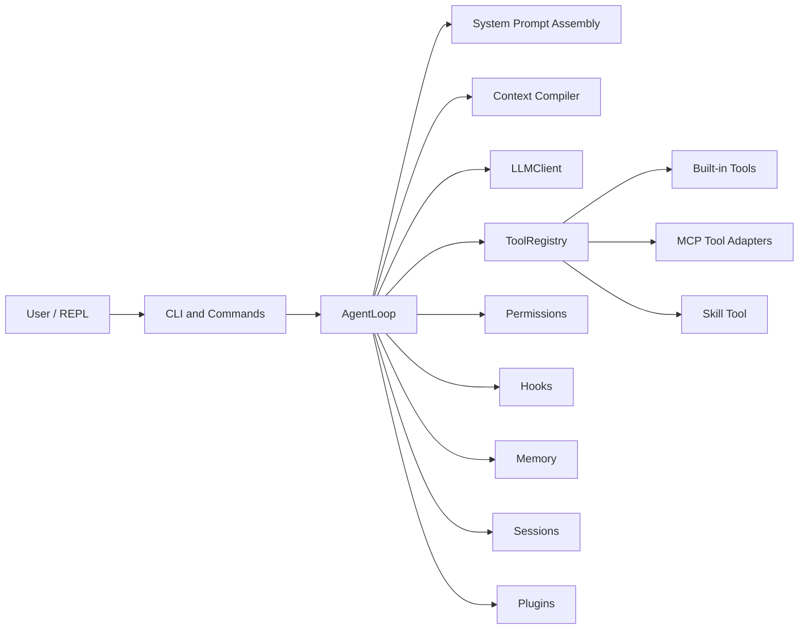

# MiniHarness

MiniHarness is a compact coding-agent harness built from first principles while
keeping the important production boundaries explicit. It is small enough to
inspect end to end, but it now contains the core concerns that make an agent
usable in real projects: session isolation, tool schemas, permissions, hooks,
MCP servers, skills, plugins, memory, and context compaction.

中文: [README.zh-CN.md](./README.zh-CN.md)

## What MiniHarness Is

MiniHarness runs a single-agent loop:

```text
user prompt
  -> dynamic system prompt + conversation history
  -> OpenAI-compatible streaming model call
  -> tool calls through ToolRegistry
  -> permission / hook checks
  -> tool results appended to conversation
  -> repeat until final assistant response
```

It is not intended to be a full agent platform. The goal is a readable,
engineering-grade miniature that keeps the important boundaries explicit.

## Current Capabilities

- Async streaming chat completions with OpenAI-compatible APIs.
- Provider profiles for Qwen/DashScope, OpenAI, and compatible endpoints.
- Pydantic-validated built-in tools exposed as OpenAI tool schemas.
- MCP client support for stdio and HTTP servers.
- MCP filesystem root adaptation with `${cwd}` / `${workspace}` templates.
- Registry-level permissions for MCP tools and built-in tool checks.
- Skills loaded from bundled, project, user, and plugin sources.
- Plugins that can contribute skills, hooks, and MCP server configs.
- Session save, list, resume, tag, and switch without mutating the old loop.
- Core, semantic, and episodic local memory.
- Hook presets for dangerous commands, sensitive paths, human approval, and audit logs.
- Context budget management and multi-tier compaction.
- Optional Docker sandbox for shell execution.

## Architecture



Key modules:

```text
src/miniharness/cli.py              CLI, REPL, slash commands
src/miniharness/loop.py             AgentLoop orchestration
src/miniharness/llm.py              OpenAI-compatible streaming client
src/miniharness/tool_registry.py    Tool schema registry and execution
src/miniharness/tools/              Built-in tools
src/miniharness/mcp/                MCP config, client, adapters, resources
src/miniharness/skills/             Skill discovery and runtime loading
src/miniharness/plugins/            Plugin discovery and contributions
src/miniharness/permissions.py      Permission decisions and confirmation
src/miniharness/hooks/              Hook events, presets, executor
src/miniharness/context/            Budgeting, carryover, compaction
src/miniharness/sessions/           Session storage and switching
src/miniharness/memory/             Core, semantic, episodic memory
```

## Tool Model

MiniHarness exposes tools to the model through OpenAI-style tool schemas, not
only through prompt text.

Built-in tools:

- `read_file` - read a UTF-8 file.
- `ls` - list directory entries.
- `grep` - search literal text.
- `write_file` - create or overwrite a file.
- `edit_file` - replace an exact string in a file.
- `bash` - run a shell command in the workspace or sandbox.
- `web_fetch` - fetch a URL and convert HTML to text.
- `task` - maintain a replace-all task list.
- `memory_search` - search project memory.
- `memory_add` - add a semantic memory fact.
- `memory_log` - record completed work.
- `list_mcp_resources` / `read_mcp_resource` - inspect MCP resources.
- `mcp_auth` - update MCP credentials for configured servers.
- `skill` - load detailed skill instructions on demand.

MCP tools are wrapped as:

```text
mcp__<server>__<tool>
```

The adapter derives the callable schema from the MCP tool input schema and
routes execution through the MCP client manager.

## MCP

MCP server configuration is loaded from:

```text
~/.miniharness/mcp.json
<project>/.miniharness/mcp.json
MINIHARNESS_MCP_SERVERS
plugin mcp.json files
```

Project config overrides user config for the same server name. Project config is
discovered relative to the process working directory when `mh` starts, so the
normal workflow is to `cd` into the target project before launching MiniHarness.
The `--cwd` flag changes the agent workspace and template expansion, but it does
not reload another project's `.miniharness/mcp.json`. JSON files may contain
`//` or `#` comment lines.

Example:

```json
{
  "mcpServers": {
    "filesystem": {
      "type": "stdio",
      "command": "npx",
      "args": ["-y", "@modelcontextprotocol/server-filesystem"],
      "allowed_directories": ["${cwd}"]
    },
    "fetch": {
      "type": "stdio",
      "command": "uvx",
      "args": ["mcp-server-fetch"]
    },
    "context7": {
      "type": "stdio",
      "enabled": false,
      "command": "npx",
      "args": ["-y", "@upstash/context7-mcp"]
    }
  }
}
```

Notes:

- `allowed_directories` and `roots` are aliases for filesystem MCP roots.
- `${cwd}`, `${workspace}`, `${project}`, and `${home}` are expanded at runtime.
- `enabled: false` keeps a server configured but prevents startup.
- MCP tools still pass through MiniHarness permission checks before execution.

## Skills

Skills are markdown instruction files. MiniHarness does not inject every skill
body into the system prompt. It injects a compact skill index and gives the
model a single `skill` tool. When a task matches a skill description, the model
loads the full skill content with:

```json
{"name": "code-review"}
```

Skill sources, from lower to higher priority:

```text
bundled skills
project .miniharness/skills/<name>/SKILL.md
project .claude/skills/<name>/SKILL.md
user ~/.miniharness/skills/<name>/SKILL.md
plugin skills
```

Skill frontmatter can mark a skill as model-invocable or user-only.

## Plugins

Plugins are discovered from:

```text
~/.miniharness/plugins/<name>/
<project>/.miniharness/plugins/<name>/
```

A plugin can contain:

```text
plugin.json      required manifest
skills/          optional skill definitions
hooks.json       optional hook definitions
mcp.json         optional MCP server definitions
```

Use `/plugins` in the REPL to list, inspect, enable, or disable plugins.

## Permissions And Hooks

MiniHarness separates permissions from hooks:

- Permissions answer: "Should this tool invocation be allowed in this mode?"
- Hooks answer: "Does this invocation match a known dangerous pattern?"

Permission modes:

- `default` - confirm write, shell, and unknown mutating operations.
- `accept-edits` - allow file edits, confirm shell commands.
- `bypass` - allow operations except hard-denied critical paths.
- `plan` - read-only mode.

Critical paths such as SSH keys, cloud credentials, and selected system files
are blocked as a defense-in-depth layer.

Hooks can block or confirm dangerous shell commands, sensitive file access,
human-approval operations, and audit events. Audit logs are written under
`~/.miniharness/audit/` by default.

## Sessions

Sessions are stored under:

```text
~/.miniharness/sessions/<project-slug>/
```

The REPL supports:

```text
/sessions         list saved sessions
/resume [id|tag]  switch to a saved session
/tag <name>       tag the current session
```

Session switching creates a fresh `AgentLoop` with the target conversation
instead of mutating the old loop in place. This keeps session IDs, conversation
history, and save targets isolated.

## Context Engineering

The system prompt is rebuilt each turn with:

- static agent instructions,
- OS, shell, date, home, and working directory,
- tool count,
- connected MCP server summary,
- available skill index,
- core memory,
- relevant semantic and episodic memories.

The tool schemas are passed separately through the model API.

When the estimated context exceeds the configured budget, MiniHarness compacts
in tiers:

1. Microcompact stale tool output.
2. Collapse oversized text blocks.
3. Summarize earlier turns into session memory.
4. Fall back to an LLM-generated structured summary with carryover attachments.

## Quick Start

Install dependencies:

```bash
git clone <repo-url>
cd miniharness
uv sync --extra dev
```

Configure credentials:

```bash
cp .env.example .env
```

Set one of:

```text
DASHSCOPE_API_KEY
OPENAI_API_KEY
MINIHARNESS_API_KEY
```

Run:

```bash
uv run mh "explain this project"
uv run mh
uv run mh --cwd /path/to/project "inspect the codebase"
uv run mh --continue
uv run mh --resume <session-id-or-tag>
uv run mh --dry-run "test config"
```

## CLI Options

```text
uv run mh [PROMPT] [OPTIONS]

--cwd             working directory for tools and `${cwd}` expansion
--profile         provider profile
--model, -m       override model name
--base-url        override API base URL
--dry-run         print resolved settings and exit
--max-turns       maximum agent loop turns
--temperature     sampling temperature
--top-p           nucleus sampling threshold
--max-tokens      maximum output tokens
--sandbox         enable Docker sandbox
--no-sandbox      disable Docker sandbox
--sandbox-image   Docker image for sandbox
--continue, -c    resume the most recent session
--resume          resume a session by ID or tag
--sessions        list saved sessions and exit
```

## REPL Commands

```text
/help                 show commands
/exit, /quit, /q      exit
/clear                clear conversation history
/history              show message count
/model                show or switch model
/turns                show or set max turns
/permissions          cycle or inspect permission mode
/temperature          show or set temperature
/top-p                show or set top_p
/max-tokens           show or set max output tokens
/memory               inspect memory
/hooks                show hook configuration
/skills               list skills
/plugins [name]       list, inspect, or toggle plugins
/tools [name] [json]  list, inspect, or execute tools
/mcp                  show MCP server status
/sessions             list sessions
/resume [id|tag]      resume session
/tag <name>           tag current session
```

During a running model/tool turn, slash commands are not read until the turn
returns. Press `Ctrl-C` to cancel the current turn and return to the prompt.

## Configuration

Settings are resolved in this order:

```text
defaults
-> user MCP config
-> project MCP config
-> MINIHARNESS_MCP_SERVERS
-> environment variables
-> provider auto-detection
-> CLI overrides
```

Common environment variables:

```text
MINIHARNESS_PROFILE
MINIHARNESS_MODEL
MINIHARNESS_BASE_URL
MINIHARNESS_MAX_TURNS
MINIHARNESS_TEMPERATURE
MINIHARNESS_TOP_P
MINIHARNESS_MAX_TOKENS
MINIHARNESS_SANDBOX_ENABLED
MINIHARNESS_SANDBOX_IMAGE
DASHSCOPE_API_KEY
OPENAI_API_KEY
MINIHARNESS_API_KEY
```

## Testing

```bash
uv run pytest
uv run ruff check .
python3 -m compileall src/miniharness
```

The current test suite covers permissions, MCP security behavior, hooks,
sessions, memory, sandbox path validation, tool registry behavior, messages,
skills, and provider defaults.

## Known Limits

- MiniHarness is a compact harness, not a full agent platform replacement.
- Direct MCP tools are exposed once connected. Plugin-contributed MCP tools are
  gated by plugin activation. A future production step is semantic per-turn tool
  selection for large direct MCP/tool sets.
- MCP schemas and descriptions come from external servers and should be treated
  as untrusted metadata.
- `edit_file` uses exact string replacement, not patch application.
- `/q` exits only when the REPL is waiting for input; use `Ctrl-C` to cancel an
  active model/tool turn.
- Docker sandboxing requires Docker on `PATH`.

## License

MIT
