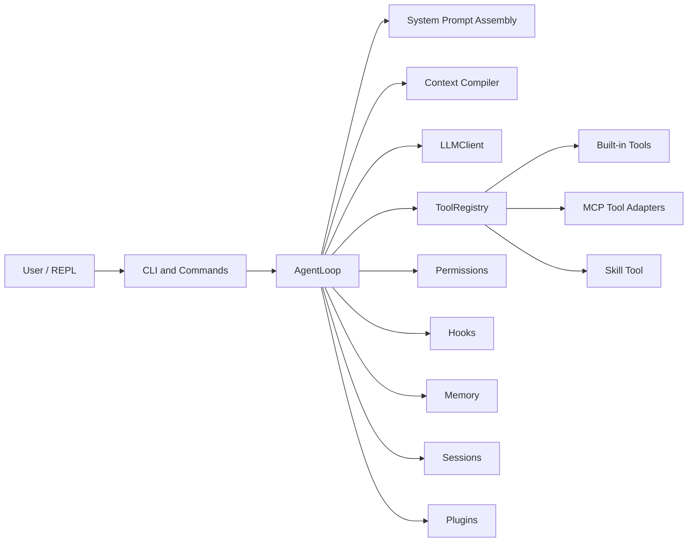

# MiniHarness

MiniHarness 是一个从零构建的紧凑型 coding-agent harness。它参考
OpenHarness 这类更完整系统的架构边界，但保持代码规模可读；同时已经覆盖
真实项目中 agent 必须面对的核心问题：会话隔离、工具 schema、权限、hooks、
MCP、skills、plugins、记忆和上下文压缩。

English: [README.md](./README.md)

## MiniHarness 是什么

MiniHarness 运行一个单 agent 循环：

```text
用户输入
  -> 动态 system prompt + 会话历史
  -> OpenAI-compatible 流式模型调用
  -> 通过 ToolRegistry 执行工具
  -> 权限 / hook 检查
  -> 工具结果写回会话
  -> 循环直到最终 assistant 响应
```

它不是完整 OpenHarness 克隆。它的目标是一个可读、可验证、工程边界清晰的
miniature。

## 当前能力

- OpenAI-compatible 异步流式 chat completion。
- 支持 Qwen/DashScope、OpenAI 和兼容接口 provider profile。
- 内置工具使用 Pydantic 校验，并暴露为 OpenAI tool schema。
- 支持 stdio 和 HTTP MCP server。
- MCP filesystem server 支持 `${cwd}` / `${workspace}` 自适应根目录。
- MCP 工具接入 registry-level permission，内置工具也有权限检查。
- Skills 可从 bundled、project、user、plugin 多来源加载。
- Plugins 可贡献 skills、hooks 和 MCP server config。
- 会话保存、列表、恢复、tag、切换，并避免旧 loop 被原地污染。
- 本地 core、semantic、episodic memory。
- Hooks 预设覆盖危险命令、敏感路径、人类确认和审计日志。
- 上下文预算管理和多层压缩。
- 可选 Docker sandbox 执行 shell。

## 架构



关键模块：

```text
src/miniharness/cli.py              CLI、REPL、slash commands
src/miniharness/loop.py             AgentLoop 编排
src/miniharness/llm.py              OpenAI-compatible 流式客户端
src/miniharness/tool_registry.py    工具 schema 注册与执行
src/miniharness/tools/              内置工具
src/miniharness/mcp/                MCP 配置、client、adapter、resources
src/miniharness/skills/             Skill 发现与运行时加载
src/miniharness/plugins/            Plugin 发现与贡献项
src/miniharness/permissions.py      权限决策与交互确认
src/miniharness/hooks/              Hook 事件、预设、执行器
src/miniharness/context/            预算、carryover、压缩
src/miniharness/sessions/           会话存储与切换
src/miniharness/memory/             Core、semantic、episodic memory
```

## 工具模型

MiniHarness 不是只把工具名字和 description 写进 prompt，而是通过模型 API
传入 OpenAI 风格 tool schema。

内置工具：

- `read_file`：读取 UTF-8 文件。
- `ls`：列出目录。
- `grep`：字面量文本搜索。
- `write_file`：创建或覆盖文件。
- `edit_file`：用精确字符串替换修改文件。
- `bash`：在工作区或 sandbox 中执行 shell 命令。
- `web_fetch`：抓取 URL 并把 HTML 转为文本。
- `task`：维护整体替换式任务列表。
- `memory_search`：搜索项目记忆。
- `memory_add`：写入语义记忆。
- `memory_log`：记录已完成工作。
- `list_mcp_resources` / `read_mcp_resource`：查看 MCP resources。
- `mcp_auth`：更新 MCP server 凭证。
- `skill`：按需加载 skill 详细指令。

MCP 工具会被包装成：

```text
mcp__<server>__<tool>
```

Adapter 会从 MCP tool 的 input schema 生成可调用 schema，并通过 MCP client
manager 路由执行。

## MCP

MCP server 配置来源：

```text
~/.miniharness/mcp.json
<project>/.miniharness/mcp.json
MINIHARNESS_MCP_SERVERS
plugin mcp.json 文件
```

同名 server 下，项目配置覆盖用户配置。项目配置是在 `mh` 启动时按进程当前
目录发现的，所以正常用法是先 `cd` 到目标项目再启动 MiniHarness。`--cwd`
会改变 agent 工作目录和模板展开，但不会重新加载另一个项目的
`.miniharness/mcp.json`。JSON 文件允许 `//` 或 `#` 注释行。

示例：

```json
{
  "mcpServers": {
    "filesystem": {
      "type": "stdio",
      "command": "npx",
      "args": ["-y", "@modelcontextprotocol/server-filesystem"],
      "allowed_directories": ["${cwd}"]
    },
    "fetch": {
      "type": "stdio",
      "command": "uvx",
      "args": ["mcp-server-fetch"]
    },
    "context7": {
      "type": "stdio",
      "enabled": false,
      "command": "npx",
      "args": ["-y", "@upstash/context7-mcp"]
    }
  }
}
```

说明：

- `allowed_directories` 和 `roots` 是 filesystem MCP 根目录的别名。
- `${cwd}`、`${workspace}`、`${project}`、`${home}` 会在运行时展开。
- `enabled: false` 表示保留配置但不启动 server。
- MCP 工具执行前仍会经过 MiniHarness 权限检查。

## Skills

Skill 是 markdown 指令文件。MiniHarness 不会把所有 skill 正文都塞进 system
prompt，而是注入一个紧凑 skill 索引，并给模型一个 `skill` 工具。任务匹配
某个 skill 描述时，模型再调用：

```json
{"name": "code-review"}
```

Skill 来源优先级从低到高：

```text
bundled skills
project .miniharness/skills/<name>/SKILL.md
project .claude/skills/<name>/SKILL.md
user ~/.miniharness/skills/<name>/SKILL.md
plugin skills
```

Skill frontmatter 可以设置模型是否可调用、用户是否可通过 slash command 调用。

## Plugins

插件发现路径：

```text
~/.miniharness/plugins/<name>/
<project>/.miniharness/plugins/<name>/
```

插件可以包含：

```text
plugin.json      必需 manifest
skills/          可选 skill 定义
hooks.json       可选 hook 定义
mcp.json         可选 MCP server 定义
```

在 REPL 中使用 `/plugins` 查看、检查、启用或禁用插件。

## 权限与 Hooks

MiniHarness 把 permissions 和 hooks 分成两层：

- Permissions 负责回答：“当前模式下，这次工具调用是否允许？”
- Hooks 负责回答：“这次调用是否匹配已知危险模式？”

权限模式：

- `default`：写文件、shell、未知 mutating 操作需要确认。
- `accept-edits`：文件编辑自动允许，shell 仍需确认。
- `bypass`：除硬编码关键路径外都允许。
- `plan`：只读模式。

SSH key、云凭证、部分系统文件等 critical paths 会被防御性阻断。

Hooks 可阻断或确认危险 shell 命令、敏感文件访问、人类审批操作和审计事件。
审计日志默认写入 `~/.miniharness/audit/`。

## 会话

会话保存在：

```text
~/.miniharness/sessions/<project-slug>/
```

REPL 支持：

```text
/sessions         列出保存的会话
/resume [id|tag]  切换到保存的会话
/tag <name>       给当前会话打 tag
```

会话切换会创建一个新的 `AgentLoop` 并恢复目标 conversation，而不是原地修改旧
loop。这样 session id、上下文历史和保存目标不会互相污染。

## 上下文工程

System prompt 每轮会重建，包含：

- 静态 agent 指令；
- OS、shell、日期、home、工作目录；
- 工具数量；
- 已连接 MCP server 摘要；
- 可用 skill 索引；
- core memory；
- 与当前用户输入相关的 semantic / episodic memory。

工具 schema 则通过模型 API 的 tools 字段单独传入。

当估算上下文超过预算时，MiniHarness 会分层压缩：

1. 微压缩陈旧工具输出。
2. 折叠超长文本块。
3. 将早期对话总结为 session memory。
4. 必要时调用模型生成结构化摘要，并保留 carryover 附件。

## 快速开始

安装依赖：

```bash
git clone <repo-url>
cd miniharness
uv sync --extra dev
```

配置凭证：

```bash
cp .env.example .env
```

设置其中之一：

```text
DASHSCOPE_API_KEY
OPENAI_API_KEY
MINIHARNESS_API_KEY
```

运行：

```bash
uv run mh "explain this project"
uv run mh
uv run mh --cwd /path/to/project "inspect the codebase"
uv run mh --continue
uv run mh --resume <session-id-or-tag>
uv run mh --dry-run "test config"
```

## CLI 选项

```text
uv run mh [PROMPT] [OPTIONS]

--cwd             工具工作目录和 `${cwd}` 展开目录
--profile         provider profile
--model, -m       覆盖模型名
--base-url        覆盖 API base URL
--dry-run         显示解析后的配置并退出
--max-turns       最大 agent 循环轮数
--temperature     sampling temperature
--top-p           nucleus sampling 阈值
--max-tokens      最大输出 token
--sandbox         启用 Docker sandbox
--no-sandbox      关闭 Docker sandbox
--sandbox-image   sandbox 使用的 Docker 镜像
--continue, -c    恢复最近会话
--resume          按 ID 或 tag 恢复会话
--sessions        列出保存的会话并退出
```

## REPL 命令

```text
/help                 显示命令
/exit, /quit, /q      退出
/clear                清空会话历史
/history              显示消息数量
/model                显示或切换模型
/turns                显示或设置最大循环轮数
/permissions          切换或查看权限模式
/temperature          显示或设置 temperature
/top-p                显示或设置 top_p
/max-tokens           显示或设置最大输出 token
/memory               查看 memory
/hooks                查看 hook 配置
/skills               列出 skills
/plugins [name]       列出、查看或切换 plugins
/tools [name] [json]  列出、查看或执行 tools
/mcp                  查看 MCP server 状态
/sessions             列出会话
/resume [id|tag]      恢复会话
/tag <name>           给当前会话打 tag
```

模型或工具正在运行时，slash command 不会被读取，直到当前 turn 返回。可以按
`Ctrl-C` 取消当前 turn 并回到提示符。

## 配置

配置解析顺序：

```text
defaults
-> user MCP config
-> project MCP config
-> MINIHARNESS_MCP_SERVERS
-> environment variables
-> provider auto-detection
-> CLI overrides
```

常用环境变量：

```text
MINIHARNESS_PROFILE
MINIHARNESS_MODEL
MINIHARNESS_BASE_URL
MINIHARNESS_MAX_TURNS
MINIHARNESS_TEMPERATURE
MINIHARNESS_TOP_P
MINIHARNESS_MAX_TOKENS
MINIHARNESS_SANDBOX_ENABLED
MINIHARNESS_SANDBOX_IMAGE
DASHSCOPE_API_KEY
OPENAI_API_KEY
MINIHARNESS_API_KEY
```

## 测试

```bash
uv run pytest
uv run ruff check .
python3 -m compileall src/miniharness
```

当前测试覆盖 permissions、MCP security、hooks、sessions、memory、sandbox path
validation、tool registry、messages、skills 和 provider defaults。

## 已知限制

- MiniHarness 是紧凑型 harness，不是完整 OpenHarness 替代品。
- Direct MCP tools 连接后会暴露给模型。Plugin-contributed MCP tools 已按插件
  激活状态 gating。下一步生产级优化是对大型 direct MCP/tool 集合做语义级
  per-turn tool selection。
- MCP schema 和 description 来自外部 server，应视为不可信 metadata。
- `edit_file` 是精确字符串替换，不是 patch apply。
- `/q` 只有 REPL 等待输入时才会退出；运行中请用 `Ctrl-C` 取消当前 turn。
- Docker sandbox 需要本机安装 Docker 并可在 `PATH` 中访问。

## 许可证

MIT
