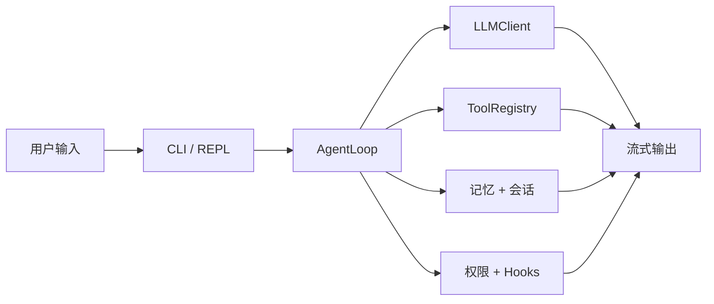

# MiniHarness

MiniHarness 是一个以教学为导向的迷你编码代理框架。它保留了代理循环的核心能力——流式模型调用、工具执行、权限控制、会话持久化、记忆、hooks 和上下文压缩——同时尽量保持代码体量小、结构清晰，方便读完就能看懂。

English: [README.md](./README.md)

## 它能做什么

- 运行单代理对话循环，并支持异步流式输出。
- 支持 Qwen（DashScope）、OpenAI 和 OpenAI-Compatible 接口。
- 通过 Pydantic 校验，向模型暴露 workspace 工具。
- 将会话保存到磁盘，方便后续恢复。
- 使用本地文件维护轻量级项目记忆。
- 通过权限和 hooks 做分层安全控制。
- 支持在可选的 Docker 沙箱里执行 bash。

## 架构概览



主流程可以理解为：

`用户输入 → 会话历史 → 流式 LLM 调用 → 工具执行 → 循环直到最终答案`

## 真实实现能力

### 代理循环

- 支持异步流式输出，并能处理 tool calls。
- 对临时 API 错误做指数退避 + 抖动重试。
- 当 prompt 超过上下文限制时，会触发上下文压缩后重试。
- 当提供方拒绝当前 `max_tokens` 时，会自动降档重试。

### 内置工具

所有工具都使用 OpenAI 风格的 schema 暴露给模型：

- `read_file`：读取工作区内的 UTF-8 文件。
- `ls`：列出目录中的文件和文件夹。
- `grep`：在工作区中做字面量文本搜索。
- `write_file`：创建或覆盖文件。
- `edit_file`：用精确字符串替换方式修改文件。
- `bash`：在工作区或沙箱里执行 shell 命令。
- `web_fetch`：抓取 URL 并将 HTML 转成纯文本。
- `task`：维护一个适合多步骤任务的“整体替换”任务列表。
- `memory_search`：搜索语义记忆和事件记忆。
- `memory_add`：写入一条语义事实。
- `memory_log`：记录一次已完成任务到事件记忆。

补充说明：

- 工具输入都经过 Pydantic 校验。
- `edit_file` 不是 unified diff，而是要求 `old_str` / `new_str` 精确匹配。
- 文件操作都受工作区边界限制。

### 安全与控制

- `read_file`、`ls`、`grep` 都是只读的。
- `write_file`、`edit_file`、`bash` 默认会要求确认。
- hooks 可以阻止危险命令和敏感路径写入。
- 审计日志默认开启，会以 JSONL 形式写入 `~/.miniharness/audit/`。
- 代码安全审查 hook 已实现，但默认关闭，以免额外消耗 token。
- 沙箱模式会把 `bash` 放在 Docker 容器中执行，默认禁网，并把工作区挂载到容器中的同一路径。

### 记忆与会话

- 核心记忆保存在项目内存目录下的 `core.md`，并会注入系统提示词。
- 相关的语义记忆和事件记忆会按需检索并加入提示词。
- 会话快照保存在 `~/.miniharness/sessions/<project-slug>/`。
- 支持按会话 ID、tag 恢复，也支持继续最新会话。

### 上下文管理

- 系统提示词会加入环境信息，例如操作系统、shell、日期和工作目录。
- 当估算的上下文预算超过软上限时，会启动四层压缩流水线：
  1. 压缩旧工具结果。
  2. 截断超长文本块的中间部分。
  3. 将前面的对话压成会话记忆摘要。
  4. 必要时调用模型生成结构化压缩摘要，并保留结构化附件。
- 默认软预算约为模型上下文窗口的 80%。

## 快速开始

1. 安装依赖

```bash
git clone <repo-url> && cd miniharness
uv sync --extra dev
```

2. 配置凭证

项目会自动加载根目录下的 `.env`。如果想使用模板，可以先复制：

```bash
cp .env.example .env
```

在 `.env` 或 shell 环境中设置支持的 provider key：

- `DASHSCOPE_API_KEY`：Qwen / DashScope
- `OPENAI_API_KEY`：OpenAI
- `MINIHARNESS_API_KEY`：兼容 API 的单 key 备用写法

3. 运行代理

```bash
uv run mh "explain this project"
uv run mh --dry-run "test"
uv run mh --sandbox "list files"
uv run mh -m gpt-4.1-mini "..."
```

如果不传 prompt，`uv run mh` 会进入交互式 REPL，并自动保存为会话。

## CLI 参考

```text
uv run mh [PROMPT] [OPTIONS]

  --cwd             工具使用的工作目录
  --profile         Provider profile (qwen, openai, openai-compatible)
  --model, -m       覆盖模型名
  --base-url        覆盖 API base URL
  --dry-run         显示解析后的配置并退出
  --max-turns       最大代理循环回合数
  --temperature     LLM sampling temperature
  --top-p           LLM nucleus sampling 阈值
  --max-tokens      最大输出 token 数
  --sandbox/--no-sandbox
                    启用或关闭 Docker 沙箱
  --sandbox-image   沙箱使用的 Docker 镜像
  --continue, -c    继续最近一次会话
  --resume          通过 ID 或 tag 恢复会话
  --sessions        列出已保存会话并退出
```

## 配置说明

设置按下面的优先级解析，从低到高：

`默认值 → 环境变量 → provider 自动检测 → CLI 覆盖`

常用环境变量：

- `MINIHARNESS_PROFILE`：强制指定 provider profile。
- `MINIHARNESS_MODEL`：覆盖模型名。
- `MINIHARNESS_BASE_URL`：覆盖 API base URL。
- `MINIHARNESS_MAX_TURNS`：最大循环回合数。
- `MINIHARNESS_TEMPERATURE`：采样温度。
- `MINIHARNESS_TOP_P`：nucleus sampling 阈值。
- `MINIHARNESS_MAX_TOKENS`：输出 token 上限。
- `MINIHARNESS_SANDBOX_ENABLED`：启用 Docker 沙箱。
- `MINIHARNESS_SANDBOX_IMAGE`：指定沙箱镜像。
- `DASHSCOPE_API_KEY`：Qwen / DashScope。
- `OPENAI_API_KEY`：OpenAI。
- `MINIHARNESS_API_KEY`：兼容接口的备用 key。

## 项目结构

```text
src/miniharness/     主要应用代码
tests/               pytest 测试
docs/                架构说明
.env.example         环境变量模板
pyproject.toml       依赖与构建配置
```

## 测试

```bash
uv run pytest -v
```

当前测试覆盖了工具注册、会话持久化、沙箱路径校验、hooks、记忆存储、权限以及 provider 默认值。

## 设计说明

- 代码各处都读取共享的 `Settings` 对象，而不是到处直接读环境变量。
- 工具都被拆成小类，并用 Pydantic 做输入校验和 schema 生成。
- 文件操作严格限制在工作区边界；启用沙箱时，还会增加容器隔离。
- hooks 和权限是两层不同的控制：hooks 负责模式匹配和阻断，权限负责按模式询问确认。
- 记忆存储是本地轻量实现，不是向量数据库。

## 局限性

- 这是一个精简版 harness，不是完整的 OpenHarness 克隆。
- `edit_file` 需要精确字符串匹配，格式略有差异就可能失败。
- 沙箱模式依赖本机已安装 Docker，并且 Docker 需要在 `PATH` 中可用。
- 上下文压缩是启发式的，超大对话里仍可能损失部分细节。

## 许可证

MIT

